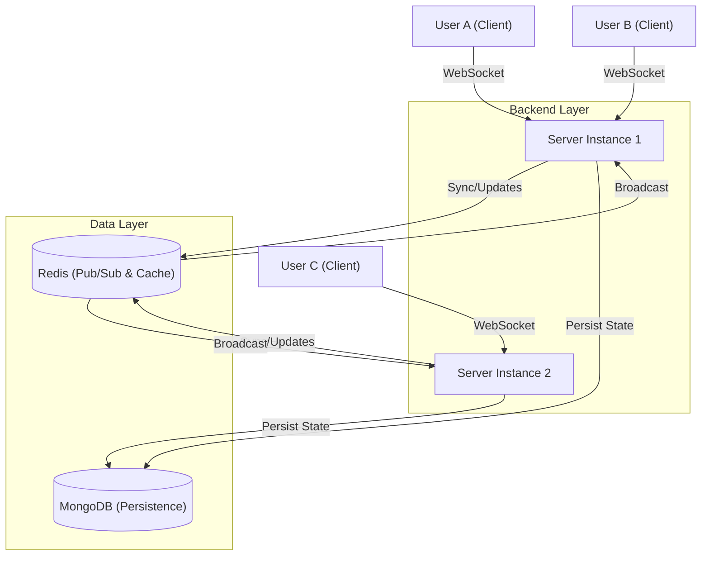
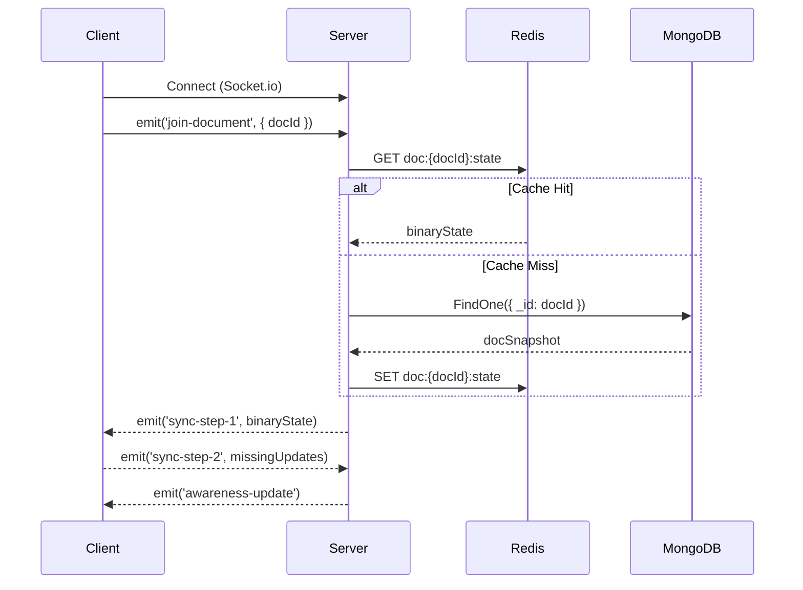
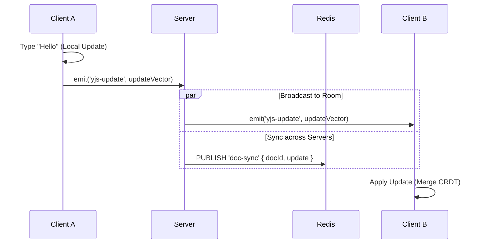

# Architecture Documentation

## 1. High-Level Design (HLD)

### System Overview
The Real-Time Collaborative Text Editor is a distributed application designed to allow multiple users to edit documents simultaneously with eventual consistency. It leverages **CRDTs (Conflict-free Replicated Data Types)** for decentralized conflict resolution and **WebSockets** for real-time communication.

### Core Components
1.  **Client (Frontend)**: React application using `Quill` editor and `Yjs` for state management. Connects via `Socket.io` to the server.
2.  **Server (Backend)**: Node.js/Express server that acts as a signaling relay for Yjs updates and manages persistence.
3.  **Redis (Pub/Sub & Cache)**:
    *   **Pub/Sub**: Synchronizes document updates across multiple server instances (scalability).
    *   **Cache**: Stores the "hot" state of active documents in memory for fast access.
4.  **MongoDB (Persistence)**: Durable storage for document snapshots and user metadata.

### Architecture Diagram

---

## 2. Low-Level Design (LLD)

### Data Conflict Resolution (CRDTs)
We use **Yjs** as the underlying CRDT library.
*   **Document State**: Each document is a `Y.Doc`.
*   **Text syncing**: The content is stored in a `Y.Text` type named `"quill"`.
*   **Awareness**: User cursors and presence are handled by `y-protocols/awareness`.

### Database Schema (MongoDB)
*   **User**: `_id`, `email`, `name`, `avatar`, `color`, `isGuest`.
*   **Document**: 
    *   `_id`: UUID
    *   `title`: String
    *   `owner`: Ref(User)
    *   `collaborators`: [Ref(User)]
    *   `state`: Buffer (Binary Yjs snapshot)
    *   `version`: Number

### Redis Data Structures
1.  **Document State Cache**: 
    *   Key: `doc:{docId}:state`
    *   Value: Binary update encoding of the Yjs document.
2.  **Pub/Sub Channel**:
    *   Channel: `doc-sync`
    *   Message: JSON `{ docId: string, update: string (base64) }`

### API & WebSocket Events

#### HTTP API
*   `POST /api/auth/login`: Authenticate user.
*   `GET /api/documents`: List user documents.
*   `POST /api/documents`: Create new document.
*   `GET /api/documents/:id`: Get document metadata.

#### Socket.io Events
| Event Name | Direction | Payload | Description |
| :--- | :--- | :--- | :--- |
| `join-document` | Client -> Server | `{ docId }` | User joins a doc room. |
| `yjs-update` | Bidirectional | `{ update }` | Incremental Yjs binary update. |
| `awareness-update` | Bidirectional | `{ update }` | Cursor/Selection updates. |

---

## 3. Sequence Diagrams

### 1. User Joins Document

### 2. Real-Time Editing Flow

